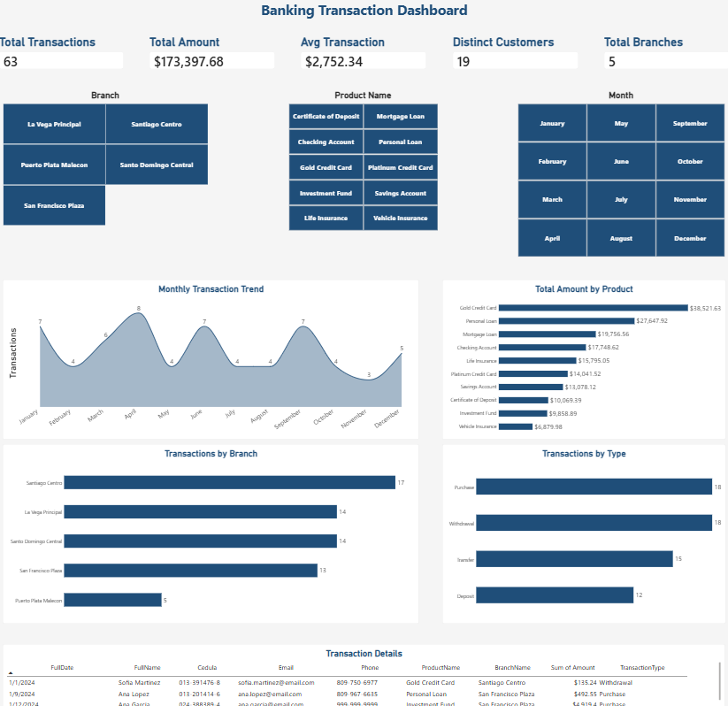
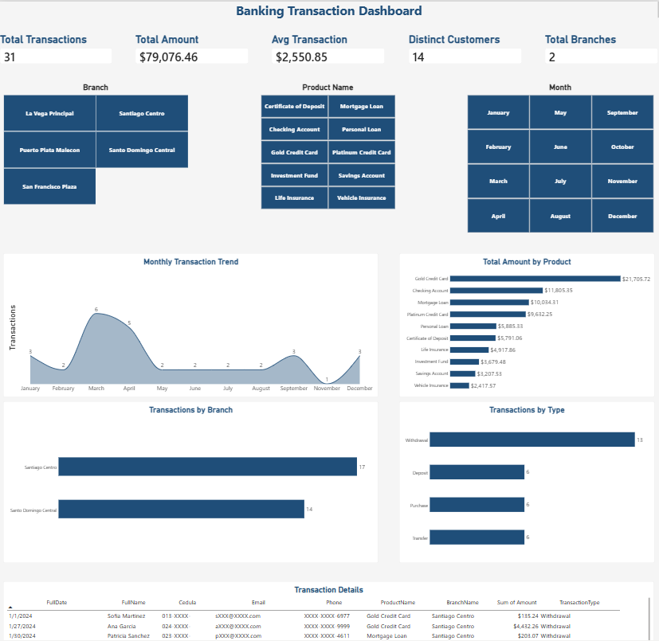
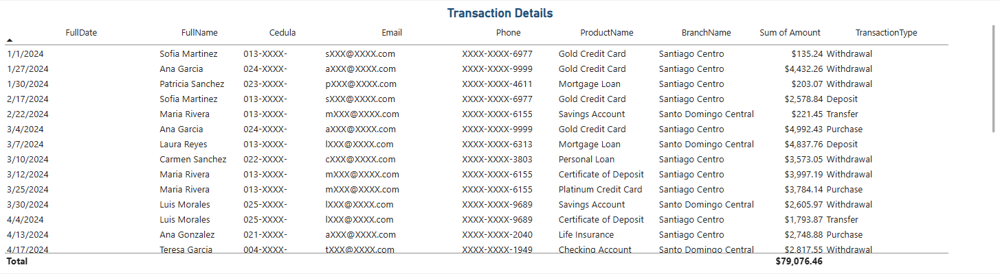
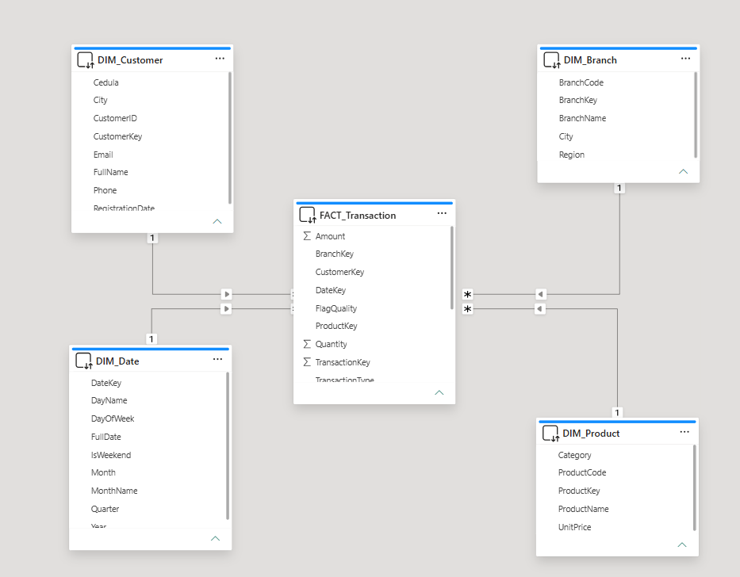
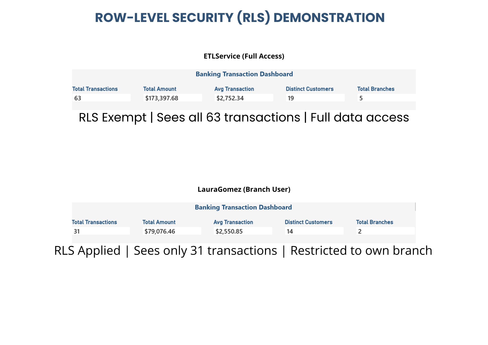

# Banking Data Warehouse & Security Layer

**Status:** Core DWH Complete | Security Layer: RLS, DDM & Auditing Fully Implemented | Deployment Orchestrated | Automated Testing Suite Added | Performance Optimized

A fully functional Data Warehouse for a simulated banking environment, extended with SQL Server security controls including Row-Level Security on fact and dimension tables, Dynamic Data Masking, native auditing, role-based permissions, an automated testing suite, and performance optimization.

---

## Project Overview

This project simulates the integration of two hypothetical banking systems to build a unified view of customers and transactions. It addresses common data engineering challenges such as inconsistent formats, duplicates, standardization, and data quality validation.

### What makes this project unique

Beyond the ETL pipeline and Star Schema model, the project includes a complete SQL Server security layer, an automated testing suite, and an orchestrated deployment script that rebuilds the database and its security controls from scratch.

- **Row-Level Security (RLS) on `FACT_Transaction`:** Analysts are restricted to transactions from their assigned branches. ✅ Implemented & Tested
- **Row-Level Security (RLS) on `DIM_Customer`:** Analysts only see customers associated with transactions in their assigned branches. ✅ Implemented & Tested
- **Performance Optimization:** Composite indexes support the RLS predicates and customer-access subquery. ✅ Optimized & Measured
- **Dynamic Data Masking (DDM):** Masks PII including `Cedula`, `Email`, and `Phone` for non-privileged users. ✅ Implemented & Tested
- **Native SQL Server Auditing:** Captures `SELECT`, `INSERT`, `UPDATE`, and `DELETE` activity on sensitive tables and supports consolidation into `Security.AuditLog`. ✅ Implemented & Tested
- **Automated Testing Suite:** Comprehensive test coverage for RLS, DDM, and Auditing using SQL scripts and Python (pytest). ✅ Implemented & Tested
- **Orchestrated Deployment:** `deploy.sql` creates the database, server principals, users, data, RLS, DDM, permissions, auditing, and post-deployment verification. ✅ Implemented & Tested

---

## Professional Objective

This repository is part of my technical portfolio, demonstrating competencies for:

- Data Engineering
- Analytics Engineering
- Database Administration
- Dimensional modeling and Data Warehousing
- ETL/ELT pipeline development
- Database security and access control
- SQL Server performance optimization
- Automated testing and quality assurance for data systems
- Business intelligence and reporting

---

## Tech Stack

| Component | Technology |
|---|---|
| Extraction & Load | Python, Pandas, SQLAlchemy, pyodbc |
| Database | SQL Server Developer Edition |
| Modeling | Star Schema |
| Security | RLS, Dynamic Data Masking, Native Auditing |
| Testing | SQL (SSMS), Python (pytest, pyodbc) |
| Deployment | T-SQL orchestrated deployment (`deploy.sql`) |
| BI / Dashboards | Power BI Desktop |
| Version Control | Git / GitHub |

---

## Key Features

### 1. Dimensional Modeling

The warehouse uses a classic Star Schema with four dimensions and one fact table:

- `DIM_Customer`
- `DIM_Product`
- `DIM_Date`
- `DIM_Branch`
- `FACT_Transaction`

The current synthetic dataset contains:

| Table | Rows |
|---|---:|
| `DIM_Customer` | 20 |
| `DIM_Product` | 10 |
| `DIM_Date` | 366 |
| `DIM_Branch` | 5 |
| `FACT_Transaction` | 63 |

### 2. Automated ETL Pipeline

The Python pipeline:

- Generates synthetic banking data.
- Cleans and standardizes formats.
- Deduplicates customer records.
- Loads transformed data into SQL Server.
- Maintains key relationships during loading.

Main scripts:

```text
src/generate_data.py
src/etl_pipeline.py
```

### 3. Enterprise Security Layer

#### Row-Level Security — `FACT_Transaction`

The transaction predicate checks the current database user and the row's `BranchKey` against `Security.UserBranch`.

Analyst mappings:

- `LauraGomez` → branches 1 and 2
- `CarlosMendez` → branch 3

`AuditCompliance`, `DWHAdmin`, and `ETLService` are exempted from the RLS filter.

#### Row-Level Security — `DIM_Customer`

The customer predicate checks whether a customer has a transaction in a branch assigned to the current analyst.

Current synthetic test results:

| User | Transactions | Customers |
|---|---:|---:|
| `LauraGomez` | 31 | 14 |
| `CarlosMendez` | 14 | 12 |
| `AuditCompliance` | 63 | 20 |
| `DWHAdmin` | 63 | 20 |

#### RLS Verification Note

`DIM_Customer` and `FACT_Transaction` are protected by RLS. Therefore, a plain `COUNT(*)` can return `0` when executed under a context that is not exempt from the RLS predicates.

For administrative verification, run the count query as `DWHAdmin` or `AuditCompliance`:

```sql
USE BankingDWH;
GO

EXECUTE AS USER = 'DWHAdmin';

SELECT 'DIM_Customer' AS TableName, COUNT(*) AS TotalRows
FROM dbo.DIM_Customer
UNION ALL
SELECT 'DIM_Product', COUNT(*)
FROM dbo.DIM_Product
UNION ALL
SELECT 'DIM_Date', COUNT(*)
FROM dbo.DIM_Date
UNION ALL
SELECT 'DIM_Branch', COUNT(*)
FROM dbo.DIM_Branch
UNION ALL
SELECT 'FACT_Transaction', COUNT(*)
FROM dbo.FACT_Transaction;

REVERT;
GO
```

Expected counts:

| TableName | TotalRows |
|---|---:|
| `DIM_Customer` | 20 |
| `DIM_Product` | 10 |
| `DIM_Date` | 366 |
| `DIM_Branch` | 5 |
| `FACT_Transaction` | 63 |

### 4. Performance Optimization

The RLS implementation is supported by:

- `Security.UserBranch (UserName, BranchKey)`
- `FACT_Transaction (CustomerKey, BranchKey)`

Measured with SQL Server `STATISTICS IO`:

| Table | Scan Count | Logical Reads | Physical Reads |
|---|---:|---:|---:|
| `FACT_Transaction` | 30 | 60 | 1 |
| `UserBranch` | 20 | 40 | 1 |
| `DIM_Customer` | 1 | 2 | 1 |

**Total Logical Reads: 102**

The indexes reduce the cost of branch authorization and the customer RLS subquery.

### 5. Dynamic Data Masking

Sensitive columns in `DIM_Customer` are masked for non-privileged users:

- `Cedula` → `partial(4, "XXXX-", 0)`
- `Email` → `email()`
- `Phone` → `partial(0, "XXXX-XXXX-", 4)`

`AuditCompliance`, `DWHAdmin`, and `ETLService` receive `UNMASK`.

Documentation:

```text
docs/security_ddm.md
```

### 6. Native SQL Server Auditing

Native auditing captures `SELECT`, `INSERT`, `UPDATE`, and `DELETE` events for:

- `dbo.FACT_Transaction`
- `dbo.DIM_Customer`

The project uses:

- Server Audit: `BankingDWH_Audit`
- Database Audit Specification: `BankingDWH_Audit_Spec`
- Audit table: `Security.AuditLog`
- Processing procedure: `Security.sp_LoadAuditLog`

Documentation:

```text
docs/security_audit.md
```

The deployment also handles an existing `BankingDWH_Audit` by disabling it before dropping and recreating it.

### 7. Automated Testing Suite

Comprehensive test coverage ensures the security layer functions correctly after every deployment:

- **SQL Tests:** Run directly in SSMS using `EXECUTE AS` to validate RLS row counts, DDM masking patterns, and audit event capture.
- **Python Tests:** Use `pytest` and `pyodbc` to programmatically verify RLS, DDM, and auditing. Ideal for CI/CD integration.
- **Test Coverage:**
  - RLS: 5 user profiles (`LauraGomez`, `CarlosMendez`, `AuditCompliance`, `DWHAdmin`, `ETLService`)
  - DDM: Masked vs. unmasked column validation
  - Auditing: SELECT/UPDATE capture, deduplication, and database scope verification

Test files:

```text
tests/sql/test_rls.sql
tests/sql/test_ddm.sql
tests/sql/test_audit.sql
tests/sql/run_all_tests.sql
tests/python/test_rls.py
tests/python/test_ddm.py
tests/python/test_audit.py
```

Documentation:

```text
docs/testing.md
tests/README.md
```

### 8. Orchestrated Deployment

The recommended deployment entry point is:

```text
deploy.sql
```

The script orchestrates:

1. Database recreation
2. Server-level logins
3. Server Audit creation/recreation
4. Security schema and database users
5. Star Schema tables
6. Synthetic data loading
7. RLS and supporting indexes
8. DDM
9. Permissions
10. Native auditing
11. Post-deployment verification

The deployment requires **sysadmin** privileges.

Deployment documentation:

```text
docs/deployment.md
```

---

## Power BI Dashboard

An interactive Power BI dashboard connected to `BankingDWH` via **DirectQuery**, leveraging SQL Server's native RLS and DDM for real-time security enforcement.

### Dashboard Components

| Component | Description |
|-----------|-------------|
| **5 KPI Cards** | Total Transactions (63), Total Amount ($173,397.68), Avg Transaction ($2,752.34), Distinct Customers (20), Total Branches (5) |
| **Monthly Transaction Trend** | Area chart showing transaction volume by month |
| **Total Amount by Product** | Bar chart with 10 products ranked by revenue |
| **Transactions by Branch** | Bar chart with 5 branches |
| **Transactions by Type** | Bar chart with transaction types |
| **Transaction Details** | 63-row table with masked customer data |
| **Slicers** | Branch, Product, and Month filters |

### Security Integration

The dashboard respects SQL Server's security layer:

- **RLS**: Users see only their assigned branch transactions
- **DDM**: Sensitive fields (`Cedula`, `Email`, `Phone`) are masked for non-privileged users

### Screenshots

#### Full Dashboard (ETLService)


#### RLS in Action — LauraGomez (31 transactions)


#### DDM in Action — Masked Customer Data


#### Data Model (Star Schema)


#### RLS Comparison (ETLService vs LauraGomez)


---

## Security Implementation Progress

| Day | Milestone | Status |
|---|---|---|
| Day 1 | Security schema, server logins, database users, branch mapping, and base permissions. | ✅ Complete |
| Day 2 | RLS predicate and policy for `FACT_Transaction`. | ✅ Complete |
| Day 3 | Schema refactoring and initial RLS optimization. | ✅ Complete |
| Day 4 | RLS on `DIM_Customer`, supporting indexes, and STATISTICS IO measurements. | ✅ Complete |
| Day 5 | RLS checkpoint and documentation. | ✅ Complete |
| Day 6 | Dynamic Data Masking on `DIM_Customer`. | ✅ Complete |
| Day 7 | Native SQL Server Auditing and audit log processing. | ✅ Complete |
| Day 8–10 | Deployment integration, deployment troubleshooting, and final verification. | ✅ Complete |
| **Day 9** | **Automated test suite (SQL + Python/pytest) added for RLS, DDM, and auditing. Created `tests/README.md` and `docs/testing.md`.** | **✅ Complete** |
| **Day 10** | **Power BI dashboard built with RLS + DDM integration. Verified security works end-to-end.** | **✅ Complete** |

---

## How to Run This Project

### 1. Clone the repository

```bash
git clone https://github.com/alejandrov07/banking-data-warehouse-etl.git
cd banking-data-warehouse-etl
```

### 2. Prepare SQL Server

Before deployment:

- Use SQL Server with sufficient privileges to create databases, logins, audits, and security objects.
- Connect with **sysadmin** privileges.
- Ensure `C:\SQLAudit\` exists.
- Ensure the SQL Server service account has write access to `C:\SQLAudit\`.
- Replace the placeholder passwords in `deploy.sql` for non-local environments.

### 3. Run the orchestrated deployment

Open:

```text
deploy.sql
```

in SSMS and execute the entire script.

This is the recommended deployment path because it handles the required object dependencies automatically.

### 4. Verify the deployment

The final verification checks row counts.

Because RLS applies to `DIM_Customer` and `FACT_Transaction`, use `DWHAdmin` or `AuditCompliance` for a full administrative verification.

Expected counts:

```text
DIM_Customer        20
DIM_Product         10
DIM_Date            366
DIM_Branch          5
FACT_Transaction    63
```

### 5. Validate RLS

Use `EXECUTE AS`:

```sql
USE BankingDWH;
GO

EXECUTE AS USER = 'LauraGomez';

SELECT COUNT(*) AS Laura_Transactions
FROM dbo.FACT_Transaction;

SELECT COUNT(*) AS Laura_Customers
FROM dbo.DIM_Customer;

REVERT;
GO

EXECUTE AS USER = 'CarlosMendez';

SELECT COUNT(*) AS Carlos_Transactions
FROM dbo.FACT_Transaction;

SELECT COUNT(*) AS Carlos_Customers
FROM dbo.DIM_Customer;

REVERT;
GO

EXECUTE AS USER = 'AuditCompliance';

SELECT COUNT(*) AS All_Transactions
FROM dbo.FACT_Transaction;

SELECT COUNT(*) AS All_Customers
FROM dbo.DIM_Customer;

REVERT;
GO
```

Expected results:

| User | Transactions | Customers |
|---|---:|---:|
| `LauraGomez` | 31 | 14 |
| `CarlosMendez` | 14 | 12 |
| `AuditCompliance` | 63 | 20 |
| `DWHAdmin` | 63 | 20 |

### 6. Validate DDM

```sql
USE BankingDWH;
GO

EXECUTE AS USER = 'LauraGomez';

SELECT TOP 5
    FullName,
    Cedula,
    Email,
    Phone
FROM dbo.DIM_Customer;

REVERT;
GO
```

The sensitive values should be masked for `LauraGomez`.

### 7. Validate Auditing

```sql
USE BankingDWH;
GO

EXECUTE AS USER = 'LauraGomez';

SELECT TOP 5 *
FROM dbo.FACT_Transaction;

SELECT TOP 5
    FullName,
    Cedula,
    Email,
    Phone
FROM dbo.DIM_Customer;

REVERT;
GO

EXEC Security.sp_LoadAuditLog;
GO

SELECT TOP 20
    event_time,
    server_principal_name,
    object_name,
    action_id
FROM Security.AuditLog
ORDER BY event_time DESC;
GO
```

### 8. Run Automated Tests

**SQL Tests (in SSMS)**

```sql
-- Run all tests
:r tests/sql/run_all_tests.sql
```

Or execute individually: `test_rls.sql`, `test_ddm.sql`, `test_audit.sql`.

**Python Tests (pytest)**

```bash
cd tests/python
pip install -r requirements.txt
pytest -v
```

For detailed instructions, see `tests/README.md`.

### 9. Install Python dependencies

```bash
pip install pandas sqlalchemy pyodbc
```

### 10. Generate and load data

```bash
python src/generate_data.py
python src/etl_pipeline.py
```

### 11. Open the dashboard

Open:

```text
dashboards/BankingDWH Dashboard.pbix
```

in Power BI Desktop.

---

## Project Structure

```text
banking-data-warehouse-etl/
├── dashboards/
│   └── BankingDWH Dashboard.pbix
├── docs/
│   ├── data_dictionary.md
│   ├── deployment.md
│   ├── lineage.md
│   ├── project_charter.md
│   ├── security_audit.md
│   ├── security_ddm.md
│   ├── security_rls.md
│   └── testing.md
├── images/
│   ├── audit_log.png
│   ├── dashboard_ddm_masked.png
│   ├── dashboard_full.png
│   ├── dashboard_rls_laura.png
│   ├── data_model.png
│   └── rls_comparison.png
├── sql/
│   ├── create_tables.sql
│   └── security/
│       ├── audit_processing.sql
│       ├── audit_setup_database.sql
│       ├── audit_setup_master.sql
│       ├── dynamic_data_masking.sql
│       ├── grant_base_permissions.sql
│       ├── rls_dim_customer_function.sql
│       ├── rls_dim_customer_index.sql
│       ├── rls_dim_customer_policy.sql
│       ├── rls_index_optimization.sql
│       ├── rls_policy.sql
│       ├── rls_predicate_function.sql
│       ├── setup_principals.sql
│       ├── test_ddm.sql
│       └── user_branch_mapping.sql
├── src/
│   ├── etl_pipeline.py
│   └── generate_data.py
├── tests/
│   ├── python/
│   │   ├── conftest.py
│   │   ├── requirements.txt
│   │   ├── test_audit.py
│   │   ├── test_ddm.py
│   │   └── test_rls.py
│   ├── sql/
│   │   ├── test_audit.sql
│   │   ├── test_ddm.sql
│   │   └── test_rls.sql
│   └── README.md
├── deploy.sql
├── .env.example
├── .gitignore
└── README.md
```

---

## Troubleshooting

### RLS verification returns 0 rows

This can be expected when the query is executed under a user/context filtered by RLS.

Use:

```sql
EXECUTE AS USER = 'DWHAdmin';
```

or:

```sql
EXECUTE AS USER = 'AuditCompliance';
```

for unrestricted administrative verification.

### `Msg 33071` when deploying

The existing Server Audit must be disabled before it can be dropped. The current `deploy.sql` handles this with:

```sql
ALTER SERVER AUDIT BankingDWH_Audit WITH (STATE = OFF);
```

before `DROP SERVER AUDIT`.

### `Msg 15530` — audit already exists

This usually indicates that the existing audit was not successfully dropped. Verify the `STATE = OFF` step before the `DROP SERVER AUDIT`.

### `Msg 15151` for `DWHAdmin`

`VIEW SERVER STATE` is a server-level permission, while `VIEW DEFINITION` is a database-level permission. They must be granted in their respective contexts.

### Audit file access errors

Verify that:

```text
C:\SQLAudit\
```

exists and that the SQL Server service account has write access.

### Login password changes are not applied

The deployment uses `IF NOT EXISTS` when creating server logins. If a login already exists, its existing password is not changed by the deployment. Use `ALTER LOGIN` to change an existing password.

### `Login failed for user` (Python tests)

Ensure the logins exist in SQL Server and the passwords are correct. For Windows Authentication, use `Trusted_Connection=yes`.

### No audit events found (Python/SQL tests)

Verify the Server Audit is enabled (`ALTER SERVER AUDIT BankingDWH_Audit WITH (STATE = ON);`) and that `C:\SQLAudit\` exists and is writable.

### RLS counts mismatch (tests)

Check that `Security.UserBranch` is correctly populated and that the RLS policies are `ON`.

### DDM does not mask (tests)

Confirm that `UNMASK` was granted only to the correct users and that restricted users do not have `UNMASK`.

---

## Performance Metrics (STATISTICS IO)

After implementing RLS on `DIM_Customer`, the measured query was:

```text
SELECT * FROM DIM_Customer
```

executed as `LauraGomez`.

| Table | Scan Count | Logical Reads | Physical Reads |
|---|---:|---:|---:|
| `FACT_Transaction` | 30 | 60 | 1 |
| `UserBranch` | 20 | 40 | 1 |
| `DIM_Customer` | 1 | 2 | 1 |

**Total Logical Reads: 102**

The results demonstrate that the security predicates remain efficient when the supporting indexes are present.

---

## Future Enhancements

- Automate audit log consolidation with SQL Server Agent jobs.
- Implement column-level encryption for highly sensitive data.
- Deploy to Azure SQL Database to test cloud-native security features.
- Expand automated deployment and integration tests.
- Add further validation around deployment success/failure handling.
- Add a GitHub Actions CI/CD pipeline to run the automated test suite on every push.

---

## Contact

**Alejandro Velazquez**

[LinkedIn](https://www.linkedin.com/in/alejandro-velazquez-9b0375387/) · [GitHub](https://github.com/alejandrov07)

Built as part of my preparation for Data Engineering and Analytics roles.

---

## Changelog — README Update

| Section | Change |
|---|---|
| Status | Updated to reflect the completed security layer, automated testing suite, orchestrated deployment, and Power BI dashboard |
| Deployment | Added `deploy.sql` as the recommended deployment entry point |
| Verification | Documented RLS-aware verification and `DWHAdmin` administrative verification |
| Key Features | Restored and integrated the "Automated Testing Suite" section (SQL + Python/pytest) |
| Tech Stack | Restored the "Testing" row |
| Security Implementation Progress | Restored Day 9 (automated testing suite) as completed and added Day 10 (Power BI dashboard) as completed |
| Power BI Dashboard | Expanded with full dashboard description: 5 KPI cards, 4 charts (monthly trend, product, branch, type), detail table, and slicers |
| Power BI Security | Documented RLS + DDM integration via DirectQuery, including screenshots for full access, RLS-restricted, and DDM-masked views |
| How to Run | Restored the "Run Automated Tests" step alongside deployment and validation steps; updated dashboard path to `dashboards/BankingDWH Dashboard.pbix` |
| Project Structure | Restored the `tests/` folder and `docs/testing.md`; kept dashboard assets in `dashboards/` and screenshots in `images/` |
| Troubleshooting | Added Server Audit and `DWHAdmin` deployment issues, plus restored test-related troubleshooting entries |
| Future Enhancements | Restored the CI/CD (GitHub Actions) note |
| Documentation | Linked `docs/deployment.md`, `docs/security_rls.md`, `docs/security_ddm.md`, `docs/security_audit.md`, and `docs/testing.md` |
| Execution | Updated Python paths to `src/` and deployment flow to the current repository structure |
| Progress | Marked deployment integration, verification, automated testing suite, and Power BI dashboard as complete |
| Screenshots | Added references to `images/dashboard_full.png`, `images/dashboard_rls_laura.png`, `images/dashboard_ddm_masked.png`, `images/data_model.png`, and `images/rls_comparison.png` |

