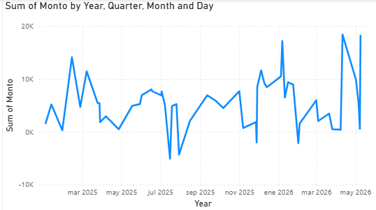
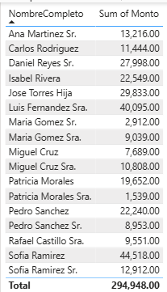
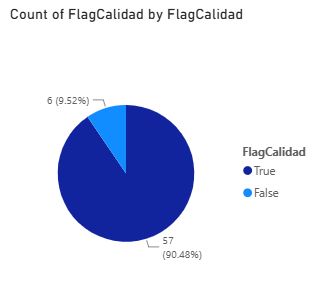

# Banking Data Warehouse & ETL Pipeline

> **ESTADO: COMPLETADO**  
> *Proyecto finalizado. Incluye diseño arquitectónico, pipeline ETL funcional y dashboards en Power BI.*

---

## Descripción del Proyecto

Diseño e implementación de un Data Warehouse para un entorno bancario simulado, aplicando principios de **arquitectura de datos**, **gobernabilidad** y **gestión de proyectos**. 

El proyecto simula la integración de dos sistemas bancarios hipotéticos (Core Bancario y Sistema de Tarjetas) para construir una visión unificada de transacciones y clientes, resolviendo problemas típicos de calidad de datos, duplicidad y falta de estándares.

---

## Objetivo Profesional

Este repositorio forma parte de mi portafolio técnico y tiene como propósito demostrar mis competencias para el rol de **Líder de Proyectos de Arquitectura de Datos**:

- Modelado dimensional (Star Schema) para Data Warehousing.
- Implementación de pipelines ETL/ELT con Python y SQL Server.
- Aplicación de controles de calidad e integridad de datos.
- Documentación de metadatos y linaje de datos.
- Visualización estratégica con herramientas de BI (Power BI).
- Gestión de proyectos y gobierno de datos.

---

## Stack Tecnológico

| Componente       | Tecnología                        |
| :--------------- | :-------------------------------- |
| **Extracción**   | Python (Pandas)                   |
| **Base de Datos**| SQL Server                        |
| **Modelado**     | Star Schema (Hechos y Dimensiones)|
| **BI / Dashboards** | Power BI Desktop              |
| **Control de Versiones** | Git / GitHub               |

---

## Dashboards en Power BI

Los datos del Data Warehouse se visualizan en un dashboard interactivo construido con Power BI Desktop. El modelo conecta las tablas `DIM` y `FACT` en un esquema estrella, permitiendo análisis de ventas, clientes y calidad de datos.

### 1. Ventas por Mes (Tendencia Temporal)
Esta tabla muestra la evolución de los montos de transacciones organizados por mes, permitiendo identificar patrones estacionales.

### 2. Top Clientes por Consumo
La tabla resume los clientes con mayor volumen de transacciones, sumando el total de montos por cliente.

### 3. Calidad de Datos
El gráfico de pastel y la tarjeta resumen la proporción de transacciones limpias (`FlagCalidad = 1`) frente a aquellas con errores (`FlagCalidad = 0`). El 90.48% de los datos superaron los controles de calidad.

---

## Estado del Proyecto

| Fase | Estado |
| :--- | :--- |
| Diseño del Star Schema | ✅ Completado |
| Diccionario de Metadatos | ✅ Completado |
| Documentación de Linaje | ✅ Completado |
| Script de creación de tablas (SQL) | ✅ Completado |
| Pipeline ETL (Python) | ✅ Completado |
| Dashboards en Power BI | ✅ Completado |

---

## Cómo ejecutar el proyecto

1. Clona el repositorio.
2. Ejecuta `sql/create_tables.sql` en SQL Server para crear las tablas.
3. Instala las dependencias: `pip install pandas sqlalchemy pyodbc`.
4. Genera los datos: `python src/generar_datos.py`.
5. Ejecuta el ETL: `python src/etl_pipeline.py`.
6. Abre `dashboards/banking_dashboard.pbix` en Power BI Desktop.

---

## Contacto

**Alejandro Velázquez**  
[LinkedIn](https://linkedin.com/in/alejandro-velazquez) · [GitHub](https://github.com/alejandrov07)

---

*Proyecto desarrollado como parte de mi preparación para el rol de Líder de Proyectos de Arquitectura de Datos.*