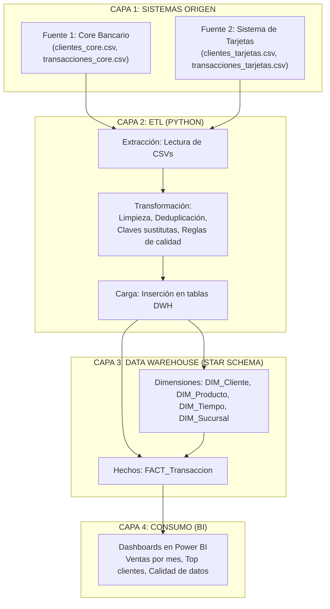

# Linaje de Datos (Data Lineage) - Cadena de Valor

## Propósito de este Documento

Este documento describe el flujo completo de los datos desde su origen hasta su consumo final. Su objetivo es proporcionar transparencia, facilitar la auditoría y permitir que cualquier miembro del equipo (desarrollador, analista, auditor) pueda rastrear un dato hasta su fuente original.

El linaje responde a tres preguntas fundamentales:
- ¿De dónde vienen los datos? (Sistemas origen)
- ¿Qué les pasa en el camino? (Transformaciones y reglas de calidad)
- ¿Dónde terminan y cómo se usan? (Data Warehouse y Dashboards)

---

## Flujo de Alto Nivel (Diagrama Conceptual)

El siguiente diagrama muestra el recorrido general de los datos a través de las cuatro capas del sistema.

---

## Flujo Detallado por Tabla

### 1. DIM_Cliente (Dimensión Cliente)

| Origen | Transformación Aplicada | Destino | Observaciones |
| :--- | :--- | :--- | :--- |
| Core Bancario (clientes_core.csv) | Lectura del archivo CSV. Estandarización de nombres (eliminar espacios múltiples, capitalizar). Formateo de cédula (eliminar guiones). Asignación de ClienteKey (clave sustituta generada automáticamente). Unificación con Tarjetas usando la Cédula como Golden Key. | DIM_Cliente | Si la cédula existe en ambas fuentes, se considera el mismo cliente y se unifica en un solo registro con ClienteKey único. |
| Sistema de Tarjetas (clientes_tarjetas.csv) | Lectura del archivo CSV. Estandarización de nombres. Formateo de cédula. Asignación de ClienteKey (clave sustituta generada automáticamente). Unificación con Core usando la Cédula como Golden Key. | DIM_Cliente | Si la cédula no existe en Core, se crea un nuevo cliente con FuenteOrigen = 'Tarjetas'. |

### 2. DIM_Producto (Dimensión Producto)

| Origen | Transformación Aplicada | Destino | Observaciones |
| :--- | :--- | :--- | :--- |
| Core Bancario (productos_core.csv) | Lectura del archivo CSV. Asignación de ProductoKey (clave sustituta). Estandarización del nombre del producto. Unificación de códigos: CodigoProducto recibe el código oficial del banco. | DIM_Producto | ProductoID_Source guarda el ID original de cada fuente. |
| Sistema de Tarjetas (productos_tarjetas.csv) | Lectura del archivo CSV. Asignación de ProductoKey. Estandarización del nombre del producto. Unificación de códigos. | DIM_Producto | Si el mismo producto existe en ambas fuentes, se unifica en un solo registro. |

### 3. DIM_Tiempo (Dimensión Tiempo)

| Origen | Transformación Aplicada | Destino | Observaciones |
| :--- | :--- | :--- | :--- |
| Generado internamente | Se genera un rango de fechas (ej. desde 2020-01-01 hasta 2030-12-31). Para cada fecha se extraen: Año, Trimestre, Mes, MesNombre, Semana, DiaSemana, DiaSemanaNombre, EsFinDeSemana. TiempoKey es generado automáticamente. | DIM_Tiempo | No proviene de sistemas fuente. Es una tabla maestra creada por el arquitecto de datos. |

### 4. DIM_Sucursal (Dimensión Sucursal)

| Origen | Transformación Aplicada | Destino | Observaciones |
| :--- | :--- | :--- | :--- |
| Core Bancario (sucursales_core.csv) | Lectura del archivo CSV. Asignación de SucursalKey (clave sustituta). | DIM_Sucursal | El Sistema de Tarjetas no tiene información de sucursales, por eso solo proviene de Core. |

### 5. FACT_Transaccion (Tabla de Hechos)

| Origen | Transformación Aplicada | Destino | Observaciones |
| :--- | :--- | :--- | :--- |
| Core Bancario (transacciones_core.csv) | Lectura del archivo CSV. Conversión de claves: el archivo trae ClienteID_Source y ProductoID_Source. Se buscan en DIM_Cliente y DIM_Producto para obtener ClienteKey y ProductoKey. Asignación de TiempoKey: la fecha de la transacción se busca en DIM_Tiempo. Validación de calidad: si Monto y Cantidad están ambos nulos, se marca FlagCalidad = 0 y se escribe el error en ObservacionCalidad. Conversión de moneda: si el monto está en DOP, se convierte a USD y se guarda en MontoUSD. Carga final: se inserta en FACT_Transaccion. | FACT_Transaccion | TransaccionID_Source guarda el ID original de la transacción. FuenteOrigen = 'Core'. |
| Sistema de Tarjetas (transacciones_tarjetas.csv) | Lectura del archivo CSV. Conversión de claves: similar al Core. Asignación de TiempoKey: similar al Core. Validación de calidad: similar al Core. Conversión de moneda: similar al Core. Carga final: se inserta en FACT_Transaccion. | FACT_Transaccion | TransaccionID_Source guarda el ID original de la transacción. FuenteOrigen = 'Tarjetas'. |

---

## Flujo de Calidad de Datos (Reglas Aplicadas)

La calidad se verifica en la capa de Transformación (Python). Cada regla genera un resultado:

| Regla ID | Descripción | Afecta a | Columna de Destino | Acción si se Incumple |
| :--- | :--- | :--- | :--- | :--- |
| R001 | Al menos una métrica (Monto o Cantidad) debe tener valor | FACT_Transaccion | Monto, Cantidad | FlagCalidad = 0, ObservacionCalidad = 'Transaccion sin monto ni cantidad' |
| R002 | Monto no puede ser negativo | FACT_Transaccion | Monto | FlagCalidad = 0, ObservacionCalidad = 'Monto negativo detectado' |
| R003 | Cedula debe tener formato de 11 dígitos si no es nula | DIM_Cliente | Cedula | FlagCalidad = 0, ObservacionCalidad = 'Formato de cedula invalido' |
| R004 | Producto debe tener categoría válida (no nula y dentro de lista) | DIM_Producto | Categoria | FlagCalidad = 0, ObservacionCalidad = 'Categoria de producto no valida' |

---

## Resumen de la Cadena de Valor (Value Chain)

| Capa | Componente | Entrada | Salida |
| :--- | :--- | :--- | :--- |
| 1. Origen | Core Bancario (CSV) | Datos transaccionales del sistema Core | Archivos CSV: clientes_core.csv, transacciones_core.csv |
| 1. Origen | Sistema de Tarjetas (CSV) | Datos transaccionales del sistema Tarjetas | Archivos CSV: clientes_tarjetas.csv, transacciones_tarjetas.csv |
| 2. Transformación | Python ETL Script | Archivos CSV | Datos transformados listos para insertar en tablas DWH |
| 3. Almacenamiento | Data Warehouse (SQL Server) | Datos transformados | Tablas: DIM_Cliente, DIM_Producto, DIM_Tiempo, DIM_Sucursal, FACT_Transaccion |
| 4. Consumo | Power BI Dashboards | Consultas SQL a las tablas del DWH | Reportes visuales: Ventas, Clientes, Productos, Calidad de Datos |

---

## Historial de Versiones

| Versión | Fecha | Autor | Cambios |
| :--- | :--- | :--- | :--- |
| 1.0 | Agosto 2026 | Alejandro Velazquez | Creación inicial del documento. |
