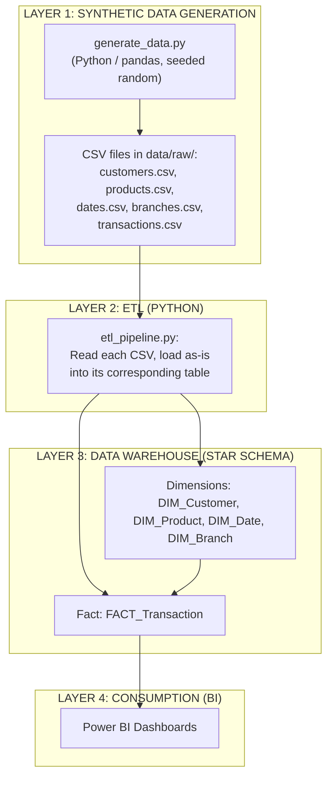

# Data Lineage - Value Chain

## Purpose of This Document

This document describes the complete flow of data from its origin to its final consumption, so any team member can trace a piece of data back to how it was produced.

---

## High-Level Flow (Conceptual Diagram)

---

## Detailed Flow by Table

### 1. DIM_Customer

| Source | Transformation Applied | Destination | Notes |
| :--- | :--- | :--- | :--- |
| `generate_data.py::generate_customers()` → `customers.csv` | None. `CustomerKey` is assigned directly by the generator (not by SQL IDENTITY at load time — the ETL runs `SET IDENTITY_INSERT ON` and loads the pre-assigned key). | DIM_Customer | This is synthetic data, not a real integration from a source banking system. |

### 2. DIM_Product

| Source | Transformation Applied | Destination | Notes |
| :--- | :--- | :--- | :--- |
| `generate_data.py::generate_products()` → `products.csv` | None. A fixed catalog of 10 hardcoded products with pre-assigned `ProductKey` values. | DIM_Product | Loaded with `IDENTITY_INSERT ON`, same as DIM_Customer. |

### 3. DIM_Date

| Source | Transformation Applied | Destination | Notes |
| :--- | :--- | :--- | :--- |
| `generate_data.py::generate_dates()` → `dates.csv` | A full calendar is generated for 2024-01-01 through 2024-12-31 using `pandas.date_range`, with `DateKey`, `Year`, `Quarter`, `Month`, etc. derived directly from each date. | DIM_Date | `DateKey` is not an IDENTITY column in SQL Server — it's the YYYYMMDD integer computed in Python and inserted directly. |

### 4. DIM_Branch

| Source | Transformation Applied | Destination | Notes |
| :--- | :--- | :--- | :--- |
| `generate_data.py::generate_branches()` → `branches.csv` | None. A fixed list of 5 hardcoded branches with pre-assigned `BranchKey` values. | DIM_Branch | Loaded with `IDENTITY_INSERT ON`, same as DIM_Customer. |

### 5. FACT_Transaction

| Source | Transformation Applied | Destination | Notes |
| :--- | :--- | :--- | :--- |
| `generate_data.py::generate_transactions()` → `transactions.csv` | For each of 63 synthetic transactions, a customer, product, date, and branch are picked at random and referenced by their surrogate keys directly (no lookup/mapping step is needed, since the keys already match). `FlagQuality` is set randomly (~90% pass, ~10% flagged) rather than derived from a validation rule. `etl_pipeline.py` inserts each row individually via a parameterized `INSERT`. | FACT_Transaction | Unlike a real-world ETL, there is no key-mapping step here because the generator already produces foreign keys that match the dimension tables. |

---

## Known Limitations of This Lineage

This is a portfolio/learning project, not a production integration. In particular:

- There is no real source system. All data is synthetically generated by a single Python script (`generate_data.py`), not extracted from two separate hypothetical systems.
- `FlagQuality` is randomly assigned at generation time, not computed from a business rule during the ETL transform step.
- There is no currency conversion, deduplication, or customer-matching logic in the current pipeline — each dimension is loaded independently and transactions reference pre-assigned keys.
- Re-running `etl_pipeline.py` without first clearing the 5 tables (`FACT_Transaction` first, then the 4 dimensions) will fail with a primary key violation, since `IDENTITY_INSERT` re-inserts the same fixed keys every run.

---

## Value Chain Summary

| Layer | Component | Input | Output |
| :--- | :--- | :--- | :--- |
| 1. Generation | `generate_data.py` | Hardcoded seed data + `random`/`numpy` (seeded) | CSV files in `data/raw/` |
| 2. Load | `etl_pipeline.py` | CSV files | Rows inserted into DIM_Customer, DIM_Product, DIM_Date, DIM_Branch, FACT_Transaction |
| 3. Storage | Data Warehouse (SQL Server) | Loaded rows | Star schema with Row-Level Security applied on FACT_Transaction |
| 4. Consumption | Power BI Dashboards | SQL queries against the DWH tables | Visual reports |

---

## Version History

| Version | Date | Author | Changes |
| :--- | :--- | :--- | :--- |
| 1.0 | August 2026 | Alejandro Velazquez | Initial document creation (Spanish, described a hypothetical two-source-system integration that was never implemented). |
| 2.0 | August 2026 | Alejandro Velazquez | Translated to English and rewritten to match the actual implemented pipeline (`generate_data.py` + `etl_pipeline.py`). |